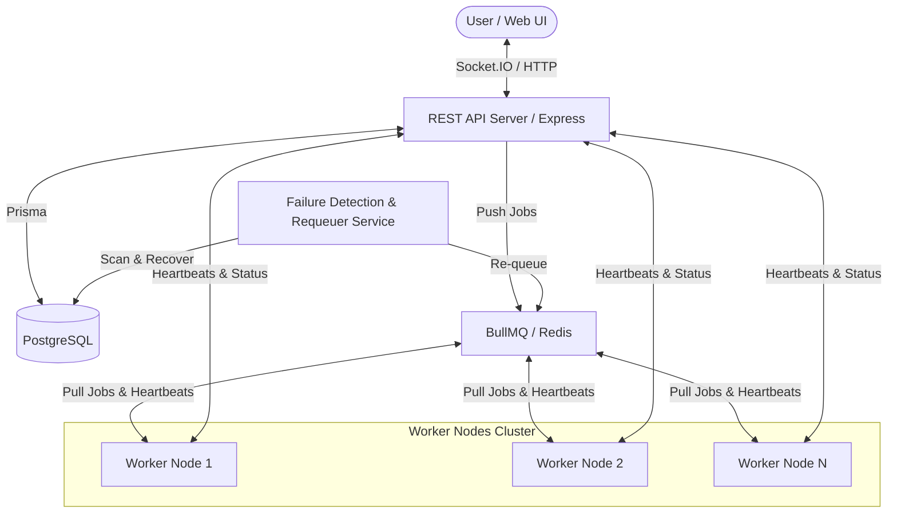

# Architecture Design: Distributed Job Execution Platform

This document describes the architectural layout, reliability strategies, and scaling mechanisms implemented in the **Distributed Job Execution Platform**.

---

## 1. High-Level Architecture

The system comprises three independent, decoupled components:
1. **Frontend Dashboard (Next.js 15)**: A state-of-the-art UI monitoring real-time pipelines and enabling job submission and global queue pauses/resumes.
2. **REST API Gateway Server (Express + TypeScript)**: Coordinates API routes, database integrations, socket feeds, worker registration checkpoints, and health metrics.
3. **Worker Nodes Cluster (BullMQ Consumers)**: Standalone processes that pull and execute tasks concurrently while checking in periodically.

---

## 2. Queue Design & Priority Strategy

By utilizing **Redis** and **BullMQ**, the queue benefits from key properties:
- **Atomicity**: Job transitions (moving from `waiting` to `active` states) are managed via optimized Lua scripts inside Redis.
- **Priority Isolation**: We support three levels: `HIGH` (Mapped to BullMQ Priority 1), `MEDIUM` (Priority 2), and `LOW` (Priority 3). BullMQ structures jobs using a sorted set (ZSET) where scores map to priority values, sorting lower values first. This guarantees that jobs waiting with priority `HIGH` are picked up by the next available worker ahead of lower priority tasks, improving execution throughput for critical operations.

---

## 3. Worker Node Orchestration & Heartbeats

- **Worker Registration**: On startup, worker processes auto-register by hitting `POST /api/workers/register` to fetch a unique UUID, which is saved in the database under `ONLINE` status.
- **Heartbeat Loop**: Active workers send keep-alive updates every 5 seconds to `POST /api/workers/heartbeat`. This updates the worker's `lastHeartbeat` timestamp in PostgreSQL.

---

## 4. Worker Crash Detection & Recovery Flow

To handle unexpected crashes (e.g. process termination, system out-of-memory, network splits), a **Failure Detection Daemon** (Monitor) runs periodically:
- Every 10 seconds, it queries PostgreSQL for worker nodes with status `ONLINE` but whose `lastHeartbeat` is older than **15 seconds**.
- **State Transition**:
  - The worker is marked `OFFLINE`.
  - It searches the `JobExecution` table for any records marked `RUNNING` that were assigned to the crashed worker.
  - For each active job found, it increments the job's `retryCount`. If the count is within the `maxRetries` limit (3), it changes the job status to `RETRYING` and re-adds it to the BullMQ queue under its initial priority. If the limit is exceeded, it sets the status to `FAILED`.
  - Every transition is logged directly into the `JobLogs` table.

---

## 5. Exponential Backoff Retry Mechanism

For temporary, transient exceptions inside jobs, the system implements an **Exponential Backoff** policy:
- **Delay formula**: $5000 \times 2^{\text{attempt} - 1}$ milliseconds.
- **Attempt Delays**:
  - Attempt 1 failure: Retries after **5 seconds**.
  - Attempt 2 failure: Retries after **10 seconds**.
  - Attempt 3 failure: Retries after **20 seconds**.
- This protects external APIs or shared database resources from being overwhelmed during failures.

---

## 6. Database Schema Design

Optimized Postgres tables use indices to support scaling under heavy loads:
- **Jobs Table**: Indexed by `status`, `priority`, and `createdAt` to make dashboard listings fast.
- **Workers Table**: Indexed by `status` and `lastHeartbeat` to optimize the failure recovery scan.
- **JobExecution / Logs Table**: Indexed by `jobId` to ensure rapid page loading when looking up a job's details and timelines.

---

## 7. Scaling Strategy

To scale the platform beyond local workloads:
1. **Queue Scalability (Redis Clusters)**: Distribute Redis instances via master-replica setups or Redis Sentinel to guarantee failovers.
2. **Worker Scaling**: Spin up dozens of containerized worker daemons (e.g., inside Kubernetes pods) subscribing to the same Redis cluster. Since BullMQ coordinates locks, workers automatically balance the load without conflict.
3. **Database Read Replicas**: Direct query-heavy reads (like dashboard lists) to PostgreSQL read replicas, keeping the write-heavy master database reserved for updates.
